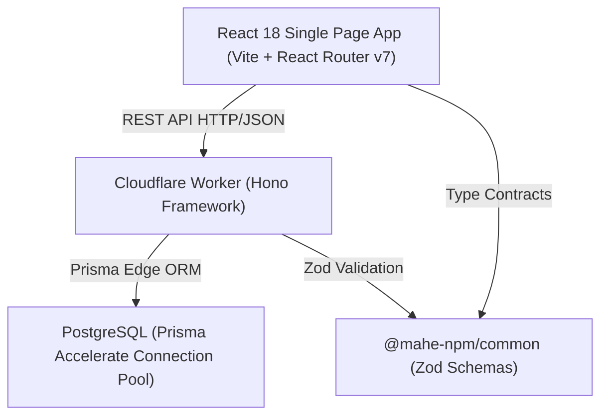
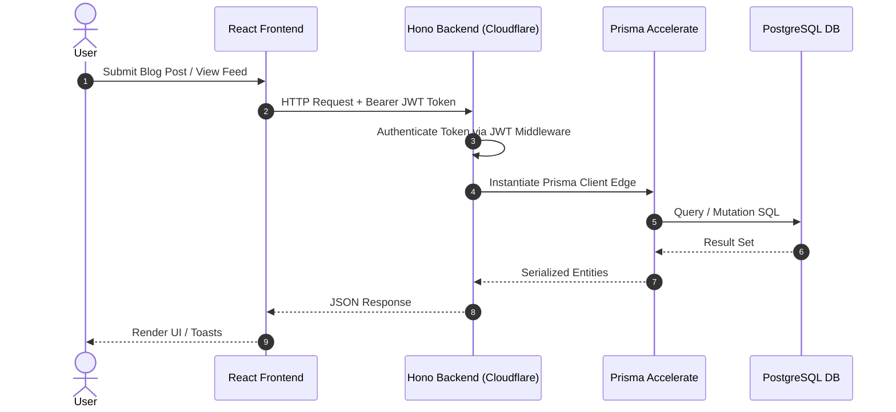

# Architecture Audit & Design System: 101dev

## 1. System Architecture Overview

The system follows a **Decoupled 3-Tier Monorepo Architecture**:

## 2. Directory Structure & Module Boundaries
- `common/`: Shared package exports Zod validation schemas (`signupInput`, `signinInput`, `createBlogInput`, `updateBlogInput`) and TypeScript types.
- `backend/`:
  - `src/index.ts`: Hono app entry point, CORS middleware, route mounting (`/api/v1/user`, `/api/v1/blog`).
  - `src/routes/userRouter.ts`: Sign up, sign in, and session check handlers.
  - `src/routes/blogRouter.ts`: Blog CRUD routes and JWT auth middleware.
  - `prisma/schema.prisma`: Data models for `User` and `Blog`.
  - `wrangler.toml`: Cloudflare Workers deployment config.
- `frontend/`:
  - `src/App.tsx`: Client routing (`/`, `/signup`, `/signin`, `/blogs`, `/blog/:id`, `/publish`).
  - `src/pages/`: Page components (`Landing`, `Signup`, `Signin`, `Blogs`, `Blog`, `Publish`).
  - `src/components/`: Reusable UI elements (`Appbar`, `BlogsCard`, `BlogCardLeft`, `Button`, `LabeledInput`, `ToggleCard`, `BlogSkeleton`, `BlogsSkeleton`, `Quote`).
  - `src/hooks/index.ts`: Custom data-fetching hooks (`useBlogs`, `useblog`).

## 3. Data & Request Lifecycle

## 4. Key Architectural Flaws Identified
1. **Prisma Client Edge Instantiation Anti-Pattern**:
   - `new PrismaClient({ datasourceUrl: c.env.DATABASE_URL }).$extends(withAccelerate())` is instantiated inside every route callback.
   - *Refactoring Target*: Attach singleton Prisma client to Hono context or instantiate outside handlers.
2. **Auth Middleware Over-reach**:
   - `blogRouter.use("/*", ...)` traps `GET /api/v1/blog/bulk` and `GET /api/v1/blog/:id`. Unauthenticated readers cannot view blogs.
   - *Refactoring Target*: Move auth middleware specifically to mutating routes (`POST`, `PUT`, `DELETE`).
3. **Missing IDOR Protection on Blog Update**:
   - `blogRouter.put("/")` updates blogs without validating `authorId == userId`.
   - *Refactoring Target*: Enforce strict resource ownership checks in database query.
