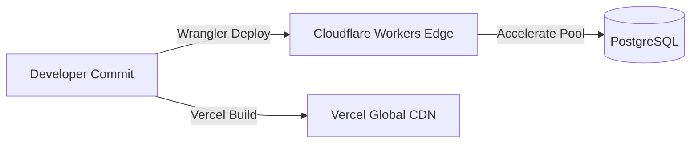

# DevOps, Environment, & Deployment Audit: 101dev

## 1. Infrastructure & Containerization Status
- **Docker Usage**: **Not Containerized**. No `Dockerfile` or `docker-compose.yml` exists.
- **Backend Infrastructure**: Cloudflare Workers serverless edge. Managed via Wrangler (`wrangler.toml`).
- **Frontend Infrastructure**: Static SPA configured for Vercel deployment (`frontend/vercel.json`).
- **Database Infrastructure**: PostgreSQL managed database connected via Prisma Accelerate connection pooling.

## 2. Environment Variables Inventory

| Variable | Target Package | Required | Purpose | Status / Risk |
| -------- | -------------- | -------- | ------- | ------------- |
| `DATABASE_URL` | `backend` | Yes | PostgreSQL connection string for Prisma Accelerate pool | Configured in `wrangler.toml` (placeholder default) |
| `JWT_SECRET` | `backend` | Yes | Secret key for signing/verifying JWT tokens | Configured in `wrangler.toml` (placeholder default) |
| `VITE_BACKEND_URL` | `frontend` | Yes | Base URL of backend API worker | Used in Axios requests (`import.meta.env.VITE_BACKEND_URL`) |

## 3. Verified Local Startup Sequence

### Prerequisites:
Node.js (v18+ recommended) and npm installed on host machine.

### Mode A: Fully Local Host Setup
1. **Common Package**:
   ```bash
   cd common
   npm install
   ```
2. **Backend Service**:
   ```bash
   cd backend
   npm install
   npx prisma generate
   npm run dev
   # Backend worker runs on http://localhost:8787
   ```
3. **Frontend Application**:
   ```bash
   cd frontend
   npm install
   npm run dev
   # Frontend app runs on http://localhost:5173
   ```

## 4. Deployment Flow & Production Risks



### Production Risks:
1. **Unsafe Placeholders**: `wrangler.toml` contains default placeholder values for `DATABASE_URL` and `JWT_SECRET`.
2. **Lack of Automated CI/CD**: No GitHub Actions workflows exist for linting, typechecking, or running automated tests prior to deployment.
